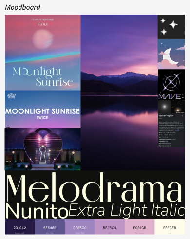
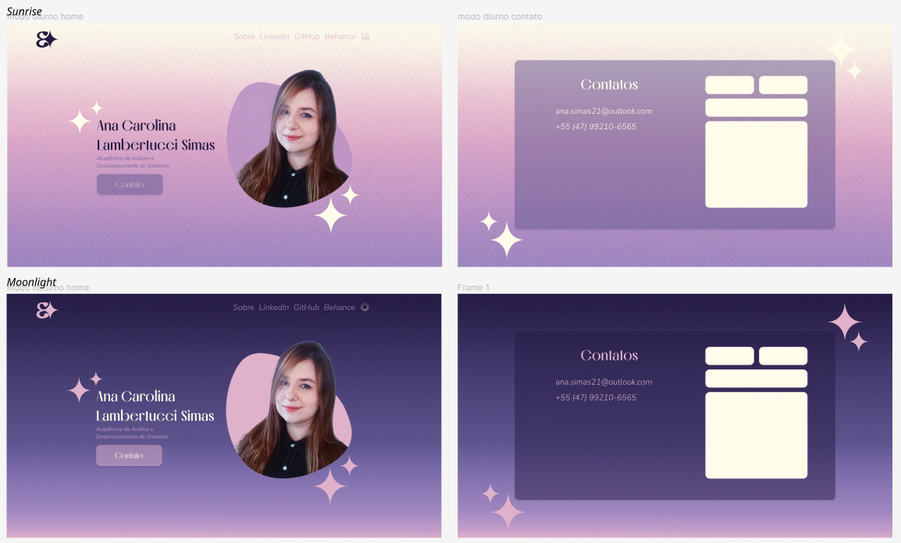

# Portfólio pessoal
#### _Overview_

O projeto é referente ao meu site com meus contatos e redes sociais. Foi criado a partir de alguns estudos de HTML e CSS, principalmente sobre as propriedades _display_. 

#### _Sobre o projeto_

A criação do site aconteceu após a criação da marca pessoal, conforme _moodboard_ abaixo:

Para mais detalhes da identidade visual, por favor, visite meu [Behance](https://www.behance.net/ana_simas).

#### _Para o futuro_
- Implementação do modo "_moonlight_" conforme projeto no Figma;
- Atualização visual de detalhes na parte "Contatos" para tornar o site mais fidedigno ao projeto no Figma;

> [LinkedIn](https://www.linkedin.com/in/ana-carolina-lambertucci-simas/)